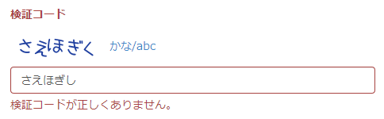
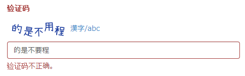

yii2-mb-captcha
===============

Multibyte captcha widget for Yii framework 2.0.





[日本語の README](README_ja.md)

Description
-----------

**softark\mbcaptcha\Captcha** is an extension to **yii\captcha\Captcha**.

While **yii\captcha\Captcha** renders a CAPTCHA image only with **English alphabets**,
**softark\mbcaptcha\Captcha** can render it with **multibyte characters** ... Japanese Hirakana
by default, but you may use any multibyte characters by providing the appropriate font.

Optionally softark\mbcaptcha\Captcha may render a link next to the CAPTCHA image which will
enable you to toggle the CAPTCHA type from the multibyte character to English alphabet, and vice versa.

**softark\mbcaptcha\Captcha** must be used together with **softark\mbcaptcha\CaptchaAction** to provide its feature.

Requirements
------------
+ Yii Version 2.0.0 or later
+ PHP GD + FreeType extension or ImageMagick extension

Usage
-----
1. Add `softark/yii2-mb-captcha` in your project's `composer.json`, and let Composer configure your project.

	```php
	"require": {
		"php": ">=5.4.0",
		"yiisoft/yii2": "*",
		"yiisoft/yii2-bootstrap": "*",
		"yiisoft/yii2-swiftmailer": "*",
		"softark/yii2-mb-captcha": "dev-master"
	},
	```

2. Use `softark\mbcaptcha\Captcha` in place of `yii\captcha\Captcha` in your view.

	```php
	/* use yii\captcha\Captcha; */
	use softark\mbcaptcha\Captcha;
	...
	<?=
		$form->field($model, 'verifyCode')->widget(Captcha::className(), [
			'template' => '<div class="row"><div class="col-lg-3">{image}</div><div class="col-lg-6">{input}</div></div>',
		]) ?>
	```

	Optionally you may want to include `{link}` token in your template.
	```php
	/* use yii\captcha\Captcha; */
	use softark\mbcaptcha\Captcha;
	<?=
		$form->field($model, 'verifyCode')->widget(Captcha::className(), [
			'template' => '<div class="row"><div class="col-lg-3">{image} {link}</div><div class="col-lg-6">{input}</div></div>',
		]) ?>
	```

3. Use `softark\mbcaptcha\CaptchaAction` in place of `yii\captcha\CaptchaAction` in your controller.

	```php
	public function actions()
	{
		return [
			'captcha' => [
				/* 'class' => 'yii\captcha\CaptchaAction', */
				'class' => 'softark\mbcaptcha\CaptchaAction',
				'fixedVerifyCode' => YII_ENV_TEST ? 'testme' : null,
			],
			...
		];
	}
	```

Properties of softark\mbcaptcha\Captcha
---------------------------------------
`softark\mbcaptcha\Captcha` supports all the properties of `yii\captcha\Captcha` and the following ones.
The items with **(*)** are the basic options that you may want to configure.

1. **template (*)** @var string

	The template for arranging the CAPTCHA widget. Defaults to `'{image} {link} {input}'`.

	This property is inherited from the parent and is extended to support the type toggling link tag.
	In this template, the tokens `{image}`, `{link}` and `{input}` will be replaced with the actual image tag,
	the type toggling link tag and the text input tag respectively.

	Note that `{link}` must be a sibling of `{image}` in the DOM tree, otherwise the toggling link won't work.

	You may omit `{link}` token if you don't want the type toggling link tag.

2. **toggleLinkLabel (*)** @var string

	The label of the type toggling link. Defaults to "かな/abc" ("Japanese Hirakana/lower-case alphabet").

	You may want to change this label when you use non-Japanese characters.

Properties of softark\mbcaptcha\CaptchaAction
---------------------------------------------
`softark\mbcaptcha\CaptchaAction` supports all the properties of `yii\captcha\CaptchaAction` and the following additional ones.
The items with **(*)** are the basic options that you may want to configure.

1. **mbFontFile (*)** @var string

	The font to be used for multibyte characters. Defaults to `seto-mini.ttf`.

	Note that **the default font only supports standard ASCII and Japanese Hirakana and Katakana**.

	You have to provide an appropriate font file if you want to render your choice of characters.

2. **seeds (*)** @var string

	The string used for generating the random word. Several characters randomly selected from this string will make up the captcha word.

	Defaults to a series of Japanese Hirakana characters: "あいうえおかきくけこがぎぐげごさしすせそざじずぜぞたちつてとだぢづでどなにぬねのはひふへほはひふへほはひふへほばびぶべぼぱぴぷぺぽまみむめもやゆよらりるれろわをん".

	You may set your own. Make sure that your `mbFontFile` can render all the characters in the `seeds`.

3. mbMinLength @var integer

	The minimum length for randomly generated multibyte character word. Defaults to 5

4. mbMaxLength @var integer

	The maximum length for randomly generated multibyte character word. Defaults to 5

5. mbOffset @var integer

	The offset between characters. Defaults to 2.
	You can adjust this property in order to decrease or increase the readability of the multibyte character captcha.

6. fixedAngle @var boolean

	Whether to render the multibyte character captcha image with a fixed angle. Defaults to false.
	You may want to set this to true if you have trouble rendering your font.

7. checkSJISConversion @var boolean

	Whether to check if conversion to shift_JIS is needed. Defaults to false.

How to Customize
----------------

The following is a sample code that shows how to customize `softark\mbcaptcha\Captcha` and `softark\mbcaptcha\CaptchaAction`.
It shows Chinese characters for the captcha.

In the view script:

```php
use softark\mbcaptcha\Captcha;
...
<?=
	$form->field($model, 'verifyCode')->widget(Captcha::className(), [
		'template' => '<div class="row"><div class="col-lg-3">{image} {link}</div><div class="col-lg-6">{input}</div></div>',
		'toggleLinkLabel' => '漢字/abc',
	]) ?>
```

And in the controller:

```php
public function actions()
{
	return [
		'captcha' => [
			'class' => 'softark\mbcaptcha\CaptchaAction',
			'seeds' => '几乎所有的应用程序都是建立在数据库之上虽然可以非常灵活的' .
				'操作数据库但有些时候一些设计的选择可以使它更便于使用首先应用程序' .
				'广泛使用了设计的考虑主要围绕优化使用而不是组成复杂语句实际上大多' .
				'的设计是使用友好的模式来解决实践中的问题最常用的方式是创建易于被' .
				'人阅读和理解的代码例如使用命名来传达意思但是这很难做到',
			'mbFontFile' => '@frontend/fonts/gbsn00lp.ttf',
		],
		...
	];
}
```

Note that the sample code assumes that you have placed your choice of font file in the 'fonts' sub-directory of your frontend application directory.

You have to be careful not to include the characters in `seeds` that are not supported by your font.

History
-------

+ Version 1.0.0 (2014-02-08)
	+ Initial release
	+ Ported from [JCaptcha](https://github.com/softark/JCaptcha) 1.0.3, which is for Yii 1.1.x.

Acknowledgment
--------------
Many thanks to [瀬戸のぞみ (Nozomi Seto)](http://nonty.net/about/) for the wonderful work of [瀬戸フォント (setofont.ttf)](http://nonty.net/item/font/setofont.php). The default font "seto-mini.ttf" is a subset of setofont.ttf.

